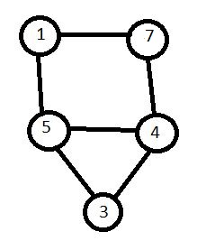
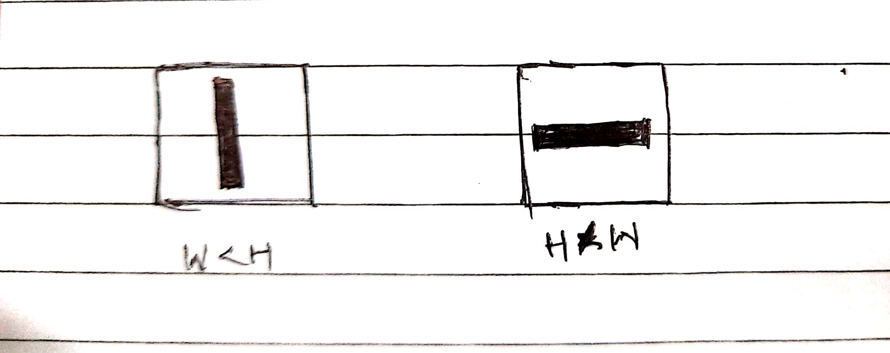
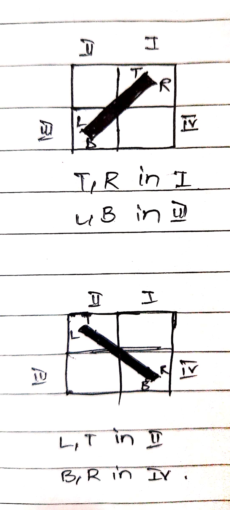
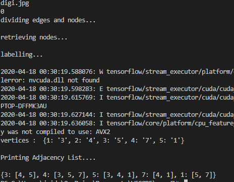

# AdaGraph
A program that takes in an image of a graph and finds the adjacency list of the graph using image processing techniques and neural networks.

## Methodology

### Testing Image:

----

### Dividing Nodes and Edges

* MORPH_OPEN = noise removal
* Canny Edging + FindContours(RETR_CCOMP)
* Extract Internal contours using contour hierarchy
* Not all internal contours are circles,there might be edge loops (to verify use is_circle()(utils.py))
* Mask if its a circle, rest is left with edges.

`Nodes Image`

`Edges Image`

----

### Labelling Nodes

* On Nodes Image, Apply Canny Edge
* FindContours() + BoundingRect() = ROI of node
* Trim the outer circle of node
* Apply FindContours on text left in node ROI
* Each contour now is a digit, each contour + boundingRect(), rescale to 28x28 px
* Pass it to pretrained model (my_model.h5) to predict the digit.
* Combine the digits from left to right, to get the complete number or label
* The pretrained model's training source code is in DigitsCNN folder.

----

### Finding Nodes of an Edge

* Each edge is segregated into 3 classes:
  * Horizontal
  * Vertical
  * Slant
* Horizontal and Vertical Classification:

W is width, H is height

* Slant Classfication: slant=1 or slant=0  or slant=-1
  * In slant classification, we dvide the ROI into 4 quadrants.
  

T is topmost point, B is bottommost point, R is rightmost point, L is leftmost point of an Edge.

* T and B becomes the end points and search for nearest center starts then and assigns the nodes to Edge.
* The classification is done for the purpose of finding start and end in case of directed graphs.
* The arrow position is found using quadrant density.

----

### Results:

----
### Limitations:

* Fails for directed graph in most cases.
* Fails sometimes in case where edges forms loops or closed figure.
* The pretrained model is not so robust in predicting digits, it needs to be changed.
